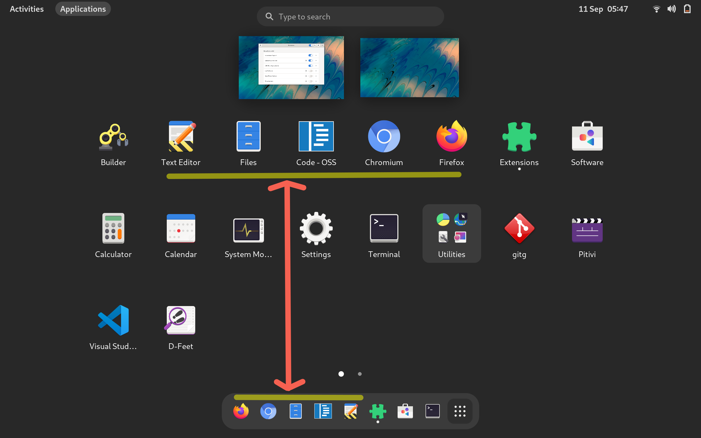

### Notice
This was forked from [Favourites in AppGrid](https://gitlab.gnome.org/harshadgavali/favourites-in-appgrid).

### Description
Starting with GNOME 40, favourite applications are only displayed in dock.
This extension makes them appear in application grid as well.

### Installation
<a href="https://extensions.gnome.org/extension/8003/favorites-to-applications-grid/">

</a>

#### From git repo
```
git clone https://github.com/NiffirgkcaJ/favorites-to-appgrid.git
cd favorites-to-appgrid
make
```

### Screenshot
